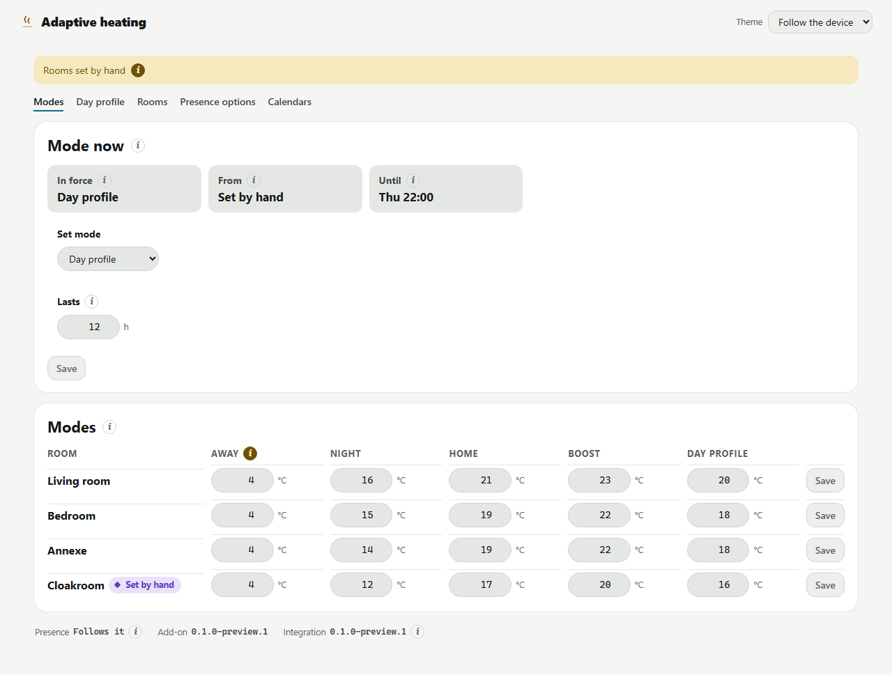

# Adaptive Heating

Room-by-room heating for Home Assistant. Each room gets a thermostat of its own, and a planner warms
it in time for the moment it is wanted.

The rooms and figures above are a made-up cabin from the render host in `addon/tools/pagehost`, not a
live house.

## Two halves

| Half | Runs | Carries |
|---|---|---|
| Integration | Inside Home Assistant | A thermostat per room, the control loop, and five actions |
| Add-on | Beside Home Assistant | Modes, the day's profile, warm-up planning, learning and the settings page |

The integration works on its own. The add-on drives the thermostats the integration creates, so
install the integration first.

## What it does

The integration:

- Builds a thermostat per room from that room's switched heaters and its own temperature sensors.
- Lets a room with no sensor of its own borrow a neighbouring room's reading.
- Stops heating while a window sensor says open.
- Refuses a heater another room already drives.
- Uses a power meter, where a room has one, to confirm a heater actually ran.
- Offers five actions to automations: `warm_room_by`, `hold_temperature`, `set_warming_rate`,
  `set_regulation` and `return_to_target`.

The add-on:

- Holds five modes — away, night, home, boost and day profile — and what each is worth in each room.
- Moves every room at each boundary of the day's profile.
- Starts a warm-up early enough for a room to reach its temperature by a set time.
- Measures each room's warming rate and how hard it must fire to hold, and writes both back.
- Reads whether anybody is home from one Home Assistant dropdown.
- Warms the house ahead of an arrival in a calendar, and writes each warm-up to a second calendar as a
  record.

## Installing the integration

Through HACS, as a custom repository.

That link opens HACS with the repository filled in. To do it by hand instead: open HACS, choose
**Custom repositories** from the menu in the top right, paste `https://github.com/0z00z0/ha-adaptive-heating`,
pick **Integration** as the type, and add it.

Then:

1. Open **Adaptive Heating** in HACS and download it.
2. Restart Home Assistant. The integration is not available until the restart finishes.
3. Go to **Settings → Devices and services → Add integration** and pick **Adaptive Heating**.

Step 3 opens the dialog that adds one room. Repeat it per room.

## Installing the add-on

That link opens the add-on store with the repository filled in. To do it by hand instead: go to
**Settings → Add-ons → Add-on store**, choose **Repositories** from the menu in the top right, and
paste `https://github.com/0z00z0/ha-adaptive-heating`.

**The image the add-on pulls is not published yet, so an install from the store cannot finish.** Until
it is, the only way onto a box is as a local add-on built there, which is written up under *Installing
the add-on on a box by hand* in `docs/mechanisms.md`.

Once installed, reload the store, open **Adaptive heating** and start it. Two switches are off on a
fresh install whatever the manifest asks for, and both are worth turning on:

- **Watchdog**, which restarts the add-on when its page stops answering.
- **Show in sidebar**, which is how the settings page is reached.

The add-on's own configuration tab takes three entities: the presence dropdown, the outdoor
temperature sensors, and a weather forecast to fall back on when every outdoor sensor is out.

## Setting it up

**A room needs at least one heater.** Any `switch` or `input_boolean` will do, and one control loop
runs per heater. Everything else in the dialog is optional: the room's own temperature sensors, a
neighbour to borrow a reading from, a window sensor, an outdoor sensor and a power meter.

**Type a temperature against each mode before expecting one to hold.** The mode table starts empty, and
a room whose mode carries no temperature keeps whatever target it already had. Fill the table on the
settings page, room by room.

**Map the presence dropdown.** The add-on reads whether anybody is home from one Home Assistant
dropdown, and what each of its options means is stored as one row per option. A first pass reads the
option text and seeds those rows from a vocabulary of English and Norwegian words. That reading happens
once, at set-up, and never again, so an option renamed later keeps the state it was mapped to.

Check the seeded rows on the **Presence options** tab. Three states carry no word in the vocabulary —
planned to arrive, on the way, and temporarily away — so an option meaning one of those lands on the
wrong row and has to be corrected by hand. A dropdown the add-on cannot tell apart is left unmapped
altogether, and an unmapped dropdown reads as somebody being home, which is the expensive answer.

**Two calendars, both optional.** One holds arrivals: an entry with a start time warms every room to
its home temperature in time for it, and an all-day entry is skipped. The other holds the record, and
must be a calendar Home Assistant keeps itself, because each warm-up is written there as an entry.

## Requirements

The integration needs Home Assistant and nothing else. **No lower version bound has been established.**
It has run on core 2026.9.1 and on core 2026.9.3.

The add-on needs a Home Assistant installation with the Supervisor, on `aarch64` or `amd64`. A 32-bit
board is not covered. It has run at Supervisor 2026.09.3 on `amd64`.

## Working on the source

Needed: the .NET 10 SDK, Python 3.13 or newer, and git.

The C# half, from `addon/`:

    dotnet build AdaptiveHeating.slnx
    dotnet test AdaptiveHeating.slnx

The Python half, from the repository root:

    python -m unittest discover -s tests

Those tests import nothing from Home Assistant, so they run on any machine with a Python interpreter.
`pytest` runs the same files where it is available. One file, `tests/test_against_home_assistant.py`,
does need Home Assistant and skips itself where it is absent.

To look at the settings page without Home Assistant:

    dotnet run --project addon/tools/pagehost
    # http://localhost:5299

It serves the real components against the real stylesheet with a cabin made up.
`addon/tools/pagehost/README.md` says how to photograph both themes.

## Where things are

| Path | Holds |
|---|---|
| `custom_components/adaptive_heating/` | The integration, laid out as Home Assistant and HACS expect |
| `custom_components/adaptive_heating/core/` | The rules the thermostat runs on, importing nothing from Home Assistant |
| `tests/` | The tests for the integration |
| `addon/` | The C# half. `AdaptiveHeating.slnx` is the solution |
| `adaptive_heating/` | The add-on manifest, its Dockerfile and its install notes |
| `docs/mechanisms.md` | How the system behaves, and where every chosen number comes from |

## Conventions

- Tabs in the C# half, four spaces in the Python half. `.editorconfig` carries both.
- Explicit types in C#, never `var`.
- en-GB in every string a person reads, in both halves.
- ISO dates, 24-hour clock, metric.

## Licence

MIT. See `LICENSE`.
